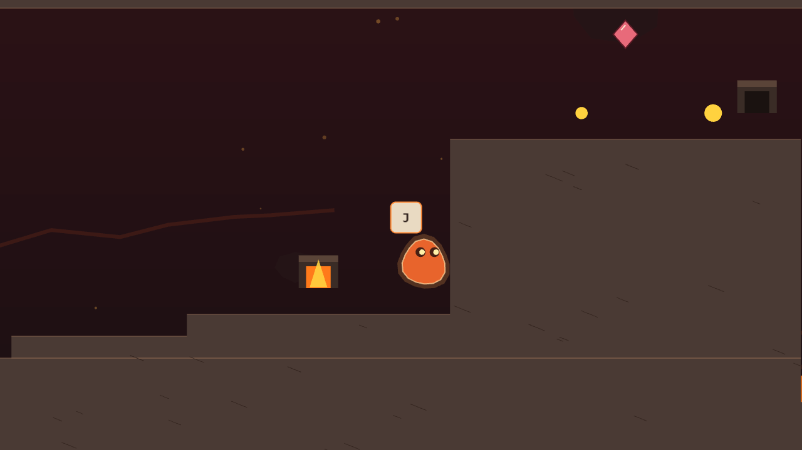
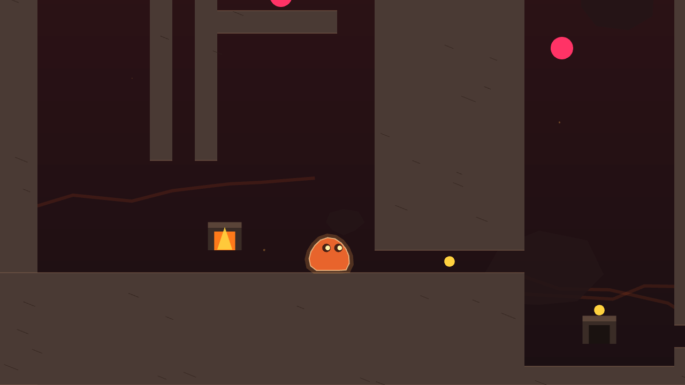
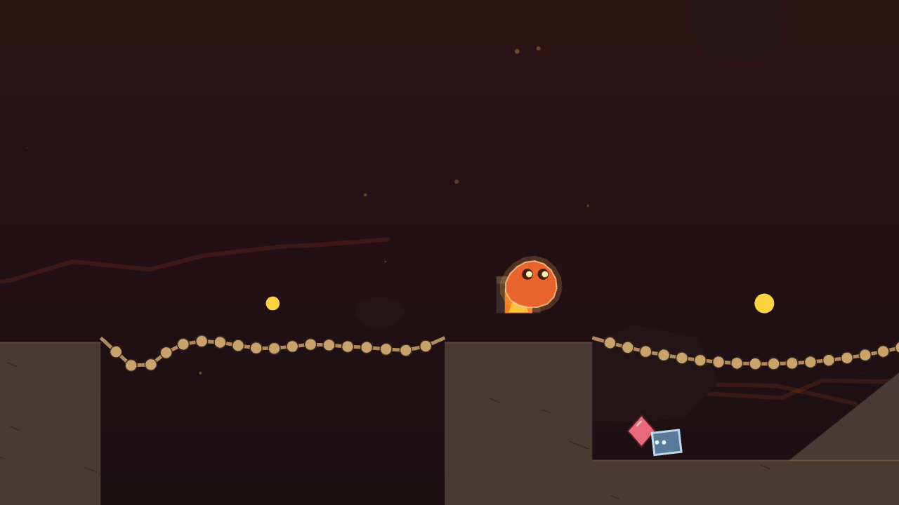

# TUFF

**Капля живой магмы против автоматического бурового комплекса.** 2D-платформер, в котором у героя нет ног и нет кнопки атаки: только тело, которое липнет, течёт, твердеет и сжимается. Рабочее название, игра в разработке.



## Что это

Кусок магмы подняли из ядра планеты как образец и держали в баке. Пробоотборник разрезал каплю надвое. Когда вторую половину увозят вниз, в Печь, герой вырывается и идёт вглубь комплекса: через криолаборатории, машинные цеха, тёмные выработки и затопленные горизонты к дну, где его ждёт хранитель регламента, который копит тепло, чтобы выжить.

Научная фантастика без крови и людей в кадре, для детей и взрослых сразу. История рассказывается стенами, машинами и тайниками, слов в игре почти нет.

## Четыре способности, один материал

| Способность | Что делает тело |
|---|---|
| **Вязкость** | Липнет к стенам и потолку, ползёт по ним, тянет за собой предметы |
| **Расплав** | Растекается и просачивается в щели, куда не пролезть |
| **Корка** | Твердеет и тяжелеет: пробивает хрупкое, давит врагов, нажимает плиты |
| **Выброс** | Сжимается и выстреливает собой вверх |

Тело это мягкое тело из частиц и связей на собственном решателе. Оно правда течёт: сплющивается под прессом, протискивается в проём в полтела, качается на цепи вместе с контейнером.



## Что уже работает

- Собственная физика мягкого тела: односторонние поверхности, контакт тел, цепи, твёрдые контейнеры, маятники, коромысла, кинематические поршни и конвейеры, плавучесть, потоки воздуха и воды, лёд и иней.
- Первый ярус собирается по поуровневым планам: залы баков, промывочные, дроны по регламенту, тайники с историей.
- Кампания: ярус 1 «Криоблок», семь уровней и бонусный подъём по стволу на время с призраком своей лучшей попытки; меню, звук синтезом, управление с клавиатуры, геймпада и касанием. Ранняя проба из семи лавовых уровней осталась стендом.
- Уровни рисуются в Tiled или описываются картами JSON, валидатор проверяет правила дизайна.
- Больше сотни автотестов: прохождения уровней ботом, фазз случайным вводом, обратимость карт.



## Запуск

```
npm install
npm run dev
```

Открыть адрес из терминала. Уровни пробы в меню, стенд элементов физики по адресу `?uroven=proba`, черновики первого яруса по `?uroven=k1-1` и `?uroven=k1-2`.

Проверка перед сдачей: `npm run check` (линт, типы, тесты, чистая комната).

## Дорога

1. Ярус 1 «Криоблок»: семь уровней и бонусный забег.
2. Бестиарий: дроны по регламенту и неудачные образцы.
3. Карта ярусов, журнал панелей, кадры спуска.
4. Ярусы 2–5, финал.
5. Веб-порталы, затем Steam.

## Стек

TypeScript, Vite, PixiJS 8, Vitest, Biome. Свой решатель частиц и связей. Без внешних физических движков.

## Права

Исходный код открыт для чтения. Все права на игру, её название, персонажей, мир и материалы принадлежат автору. Использование кода и материалов в других проектах без письменного разрешения запрещено.
